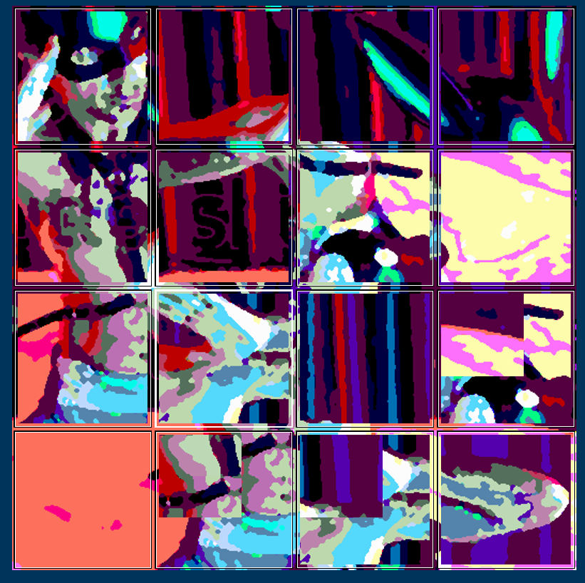

rotate_workdoc.md

Bit late to start this bit might as well.

The basic game works; you click a square, and the 4 adjacent squares rotate clockwise; the goal is to get all the colours back to their correct places.

Currently implemented:
 * custom image selection (without any image manipulation other than scale)
 * basic 'scramble' (randomly rotates random points a number of times depending on difficulty)
 * win condition
 * consistent square colour (so a moved colour can be moved again, etc.)
 * click counts

To do:
 * hint button to flash incorrect squares (potentially useful for large grids with lots of similar colours) ## basic version done, just turns them briefly white and restores.
 * image cleaning (simplify colour palette, maybe increase contrast if low, same for saturation, etc)
 * non-square images
 * zoom? Is that even possible? Probably extremely messy with how it redraws the window already.
 * fix the 'scramble' fn
 * obvs much nicer UI
 * 'gallery' of sample images for now. Later maybe levels? idk. Need to sort the difficulty curve first.
 * Re: above, start with gallery selection, use that window to get grid region size for button size/img manipulation. [note: an event in the column (eg clicking button) updates the region size to print accurately.]
 * Render a PNG of the modified image and use that as the background, instead of having each button have its own coloured background. Loading one img vs colouring all those backgrounds has to be a slight improvement, right? Still store the target_colour data the exact same way, just don't represent it via button backgrounds.
 * For tiles with virtually no difference, make them identical and interchangable. I don't want 5 identical black squares failing the challenge because technically one has a few pixels of extremely dark blue while another has extremely dark brown. Not implemented at all yet. Almost need to hash the avg colour val of the square and compare that, comparing actual filenames is really silly. Maybe I need to rework the button class so the buttons actually move and carry their images with them, instead of the button being the stationary point waiting for its colour to return. Conceptually, anyway. Hm.

Current bugs/errors:
 * since the recent change to how the grids are formed/squares are coloured, if reverting to a 5x5 grid, only the top left square is coloured. No apparent errors other than that obvious failure. Need to figure out why. But tbh that whole section is a mess of old and new parts, so should find the reason + solution in due course.
 * buttons need larger margins, can't see the background enough half the time.

1.42pm
So, figured out how to split images, give them transparent padding etc.The idea is to have the buttons be fullsize with no padding (though I'll likely have to add a minimum of padding for things to work) and for the 'padding' to actually be a transparent area of the button, which the background (the same original image/colour) will show through. Not sure if that's how it'll work but that's what I'm going to try. That or we just leave off the transparent padding and do regular padding, not sure which I want yet.

Need to totally rejig the button building. And honestly the dicts overall.

Might just run two entirely separate paths for this afternoon, one that uses image-buttons, the other what I already have. Instead of trying to blend them together. Just redo a bunch of it with images instead. Eh.

4.17pm
Getting there.
Have the data now  to set the grid size by available space, and to make image-buttons. Just need to do it now. But a rest first, exhausted.

9:24am 20/4/26
Notes:
- turn image effects on/off
- set grid size within game
- 'set image' should set start_screen=False, not just gallery selection
- 'add to gallery' button for images set
- need background image behind buttons

I can't see how to add a background image to the button grid. Might have to go back to my original idea of using button backgrounds, though I'm not sure if those can be images. Goddamn.

10.59pm
Have to shift to a sg.Graph version, I just don't think I can get it to work with the current columns/buttons. Doesn't seem to a functioning background option, and the only other way is to add the inbetween slivers as separate canvases, and that feels like a godawful 'solution'. So, graph it is. Have a working test graph in a separate script with faux buttons so the concept is sound enough.

3.54pm
Decent progress made, the grid is now in place and is clickable but the children aren't implemented yet.
Also there seems to be a sub-pixel misalignment; the lower buttons seem to move down extremely slightly and the very top ones seem to move the other way.  Need to make sure I'm storing position boxes as cleaned values so that's minimised.

5.07pm
Graph is basically working now. Rotation works as before, but now the 'buttons' have proper surrounds. There's no darkening when it's clicked which is unfortunate, but overall it works.

Currently no resolution for images with extremely similar image-tiles (eg an image with a uniform background), it currently requires the current image to be the target image.

7.41pm
scramble works again, as do hints.

7.54pm
The rotation is going the wrong way. No wonder I was struggling.

10.03pm
improved the ui some.

0.19am
exit button doesn't work during gameplay
sometimes (for reasons I don't understand yet) the tiles shown aren't correct. They appear correct but the accuracy check shows them as wrong and when you rotate it they seemingly appear out of nowhere, potentially appearing as duplicates, that then disappear when rotated. Can't see a common thread/cause yet. Will test more tomorrow.

0:54am
Now the splash screen is showing twice. I removed a bunch of extraneous code from the original version but now this is happening. Will figure it out tomorrow. Should already be in bed.

Should add a transparent square in the white square so you can still see the image underneath. Make it like a glowing border. Would help with identifying the above problem and be prettier.

11.20am 21/4/26
re splash screen showing twice:
"in align_children
in align_children"
plays twice.

So, it does this:

    ABOUT TO GENERATE `rave_shaman_temp.png` from `rave_shaman.png`

    Base image saved at: rave_shaman_temp.png
    child_dict: {full dict here}
    in align_children
    No coord_to_img_files or not coords_list
    child_dict: {full dict here}
    new_img_data found
    Base positions ordered children:

It's because setup needs the image data first to make the grid, but then the grid makes the image again.

Still not sure why the splash screen runs twice.
But for now -
going to isolate the 'new image' process, so all the data is in one place to be used by whatever needs it.

Oh - the splashscreen was running twice because I imported
#from rotate_01 import base_positions, image_data
to get the data typing for set_up_buttons. As soon as I removed that it stopped. Good to know.

Hm. Had this cause a crash:

*  File "d:\Git_Repos\rotate_game\rotate_gui_01.py", line 378, in show_incorrect
*    update_clicked_square(x, y, new_image, click_off=True)

Need to make the text output box bigger and more appealing.

Need to figure out why it's sometimes showing the wrong tile.
It seems to only come about from scrambling, I've not seen it happen in user clicking.
(Though it does rotate the wrong way, I really need to fix that.)
Maybe this?
            if not hasattr(img_data, "coord_to_img_files") or not img_data.coord_to_img_files:
                filename = g.coord_to_img_files[row][column]
            else:
                filename = img_data.coord_to_img_files[row][column]

okay. So. Singular all-purpose dictionary.
need
[row][column][tile_filename]
I have 'target' stored in the button instance. Also current. So why am I looking at the dict at all?

OH.
'start over' places the correct images, but it doesn't recognise them as correct. That's a hint.

3.25pm
Added some logging to see the dataflow. I think the summary is that I don't need the classes in rotate_01 at all anymore. All the work is done in img_manip and the gui script.
gui script gets the required filename, sends it back to rotate_01. rotate01 then sends the filename + starting dimensions etc to generate_img_grid, which generates the children and sets the initial children_dict (which does get populated).

But then:
    No coord_to_img_files or not coords_list
    gridClass new_image
    generate_children
    [generate children]
    the image is generated a second time.

So why not just move that processing step of child_dict etc to img_manip? So the initial setup sends the request, and instead of getting back the base data it needs (and apparently failing to process it), gets back all the data needed and just sends the package back to the GUI?

Okay, well - the 'coord_to_img_files' being missing is an issue, because that /is/ generated, when the images themselves are, in merge_tiles.

Ah. It wasn't generating ordered_children because I was triggering this
if selected_coord and point != selected_coord:
by feeding it the list of coords when it didn't need it. Must've confused it with somthing else. Well that's nice.

4.14pm
okay, fixed the rotation. Had to swap
#rotated_children[list(children)[new_index]] = (children[list(children)[orig_index]], b.by_coord[children[list(children)[new_index]]].current_image)
orig and new here, evidently I'd swapped the order at some point.

5.42pm
added custom rotation count + gridcounts within the game as advanced settings. Currently doesn't update the json but will.
But, have found an odd thing:

I don't know why this happened but I'm guessing perhaps it's the same root cause that had certain tiles not properly placed?
Because say, the tile in (3,2) - the halfsize one. Tht's the correct tile for that place. But the image behind it is (2,3)
As you click through, the once that have been made small stay small.

Hm. Then I had this:
  File "d:\Git_Repos\rotate_game\rotate_gui_01.py", line 308, in show_incorrect
    button_box = coord_dict[x][y]
                 ~~~~~~~~~~~~~^^^
KeyError: 4

which is bizarre, because obviously it exists. Interesting.

Can confirm as well, those tiles are actually undersized in the file, it's not a scaling issue visually; they're just smaller.

Oh, maybe it just didn't generate the image anew and happened to have thos tiles from the previous session. That'd make sense actually. Okay.

Yeah the issue was that the coord_to_img dict (or maybe a different one) wasn't being cleared even through the img was being recreated for the new gridsize, so it would recognise the old grid placement but then fail to find a matching key. Sorted now I think.

I need to make it not have to close the window to get the grid up from the gallery/user selected img. It's just so harsh. Could do a collapsible panel?

Oh, its when you scramble that it picks up the wrong size ones. Then they just stick around after that. Good to know.

Think it's fixed now.

9.31pm
Hm. Working on the 'same window' edit so I don't need to close the window to go from gallery to grid, but have encountered an odd thing: if I run it from rotate_01.py, it gives:
-   line 184, in make_row_column_dict
-     self.clean_dict[coord] = {"children": base_pos.ordered_children[(row_no, col_no)], "target_image": filename}
- KeyError: (0, 0)

but running it from rotate_gui, which just imports and runs main rom rotate_01, it works fine.

8.01am 22/4/26
hm. Now selecting an image from the gallery no longer works if it's not fullscreen. That's... odd.

Okay, fixed that. Back on fixing the layout. I have it (mostly) working so the window doesn't need to close and reopen to start showing the tile, I'm just trying to get it centred. Same issue I had previously, but sadly the fix from last time isn't working. So I'm trying a bunch of other things, but tbh it's likely just going to be 'tiny invisible canvas that makes it look right'.

Need to formalise the references. I'm sending a heap of data to both g. and img_data and I'm not sure I need img_data at all anymore. It gets me some settings etc but img_manip gets those anyway.

    self.grid_size
    self.difficulty
    self.background_colour
    self.default_screen_size
    self.is_fullscreen

are now all in theme_data.

More improvements but yet again I'm running into 'graph is not finalised'. I wish I could easily see what caused that. I mean I understand it conceptually but I don't see it in this case.

4.02pm
okay the layout basically works now.
Except if you go to the gallery and pick a new image, the text output ends up above the puzzle, when it's meant to be below. I think I have to hide/unhide them in the right order.

5.38pm have the main window fading in/out now. It's neat.

11:49am 23/4/26
made thumbnails.

next:
make it get the real img from the thumbnail name. <-- done
make the gallery a grid instead of a line that overshoots its bounds.

3.01pm
Also to note: Now, resizing the window
gives you:
aqua grid square
'waiting to scramble'
'-choose and image-'
but no gallery or side panel to select from.

Oh, actually - the gallery is down below the grid. So the issue is the grid not disappearing

8.30pm
Fixed the transition from grid>gallery>new grid. Want to make the transition softer, but it works.
Also the gallery is now a grid formed from the contents of the gallery folder, vastly improved.

'start over' doesn't properly replace the wrong tiles with the proper ones, it just displays them. I thought I fixed that before but maybe I just got distracted.
Custom images aren't saved to init like they're meant to be

8.51pm 'start over' is fixed now, I hadn't updated current_image.

9.28
can now change the grid size live; if you have an existing image up, it resets the grid with that image and the new gridsize. If you don't have an image up, it uses that gridsize when you pick one. Only thing it doesn't do currently is update the JSON.

12.32pm Huh. interesting issue.

Clicking 0/1 (top middle on a 3/3 grid) gives this:
g.clean_dict[coord]: {'children': {'top': (0, 0), 'right': (1, 1), 'bottom': (0, 2)}, 'target_image': 'row_0_col_1.png'}
CHILDREN: {'top': (0, 0), 'right': (1, 1), 'bottom': (0, 2)}

but it only rotates one square at a time:
click 1 swaps top left and top right
click 2 swaps top right and bottom
click 3 swaps top left and bottom

The right side does the same thing.
But left and bottom both work properly.

Huh. And that bug where it grabs old, differently-sized tiles. That one is probably because I didn't remove the buttons. data between grid changes yet but still. Not a fan.

Oh - and 'start over' with the 'wrong sized tiles' error in place gave me this:

    ~~~~~~~~~~~~~~^^^^^^^^^^^^^^^^^^^^
  File "d:\Git_Repos\rotate_game\rotate_gui_01.py", line 486, in show_incorrect
    button_box = g.bbox_dict[x][y]
                 ~~~~~~~~~~~~~~^^^
KeyError: 4
(.venv) PS D:\Git_Repos\rotate_game>

okay, so bbox is not being correctly reconstructed when the grid changes. Looks fine and plays fine, but bbox is broken. Might also be the reason for the wrong sized tile - if that part of the square clicked was part of another preexisting bbox, would make sense.

Okay, so have tested: bbox exists on the default grid, but not after grid size changes.
If you change the grid size in the gallery screen, then the grid is applied and it works fine. It's only when the grid is changed while the image is already shown. And this worked before. Or at least I think? Did I not test the autocomplete?

A little more specific detail:
I started with a 4/4 grid (0 - 3) and then changed to a 3/3 (0 - 2)

And the key error specifically was

    button_box = g.bbox_dict[x][y]
                 ~~~~~~~~~~~^^^
KeyError: 3

So it's not that there's no bbox, but that it's trying to find an old key in bbox that simply doesn't exist anymore. So I need to look in a different spot.
12.39pm 24/4/26
Well that was easy. One line fix to clear b.by_coord at the start of initial_grid_drawing. I meant to clear the button data when I cleared the grid data but didn't, guess this is why I should.

So. I make bbox_dict twice; once when generating the tile images, and again when initing the grid drawing. The first one is in this format:

{0: {0: (4.0, 4.0, 154.0, 154.0), 1: (162.0, 4.0, 312.0, 154.0)

and the second (from initial_grid_drawing) is like this:
{0: {0: ((3.0, 3.0), (155.4, 155.4)), 1: ((161.4, 3.0), (313.8, 155.4)),

And they all have similar discrepancies. I'm not sure why. Maybe just padding? Is the second excluding the area outside the buttons but the former is applying it? If you click the gap between buttons it just clicks whichever you were nearest to.

Oh. So...

    top_left = g.cell_w*column + (g.padding/2), g.cell_h*row + (g.padding/2)
    bottom_right = g.cell_w*(column+1) - (g.padding/2), g.cell_h * (row+1) - (g.padding/2)
    I add one to the bottom right coord here but the top left is neutral. ?

I'm investigating this properly. The formatting difference makes sense , the original buttonbox was made for the topleft/bottom right format required for image generation, but the value discrepancies are interesting. Does explain that extremely small shift that happens the first time you click an image.

some more data:
image width: 792 // col_width: 158

0,0 img_manip bbox:
(4.0, 4.0, 154.0, 154.0)

image width: 792 // col_width: 158.4
0,0 gui bbox:
((3.0, 3.0), (155.4, 155.4))

Huh.
Oh wait, of course. The '+ column' and the +1 are doing the same thing, they're both indicating the position of the next column wall. Okay, ignore that. The discrepancy is elsewhere.

image width: 792 // padding: 8// col_width: 158

0,0 img_manip bbox:
(4.0, 4.0, 154.0, 154.0)

image width: 792 // padding: 6 // col_width: 158.4
0,0 gui bbox:
((3.0, 3.0), (155.4, 155.4))

okay so padding is 8 for image_manip but 6 for the gui.
^ because I never sent g.padding, so it was just using the default 8 padding in img_manip.

image width: 792 // padding: 6// col_width: 158

0,0 img_manip bbox:
(3.0, 3.0, 155.0, 155.0)

So with that fixed:
image width: 792 // padding: 6 // col_width: 158.4
0,0 gui bbox:
((3.0, 3.0), (155.4, 155.4))

Huh. So col_width is determined...

in img_manip:
col_width = int(self.img_width / grid_size)

in initial_grid_drawing, it's just g.cell_w and g.cell_h. Which are derived from...

self.cell_h = self.img_width / self.cols
Oh, it's just... not int'd. Okay.

and trying again...

0,0 gui bbox:
image width: 792 // padding: 6 // col_width: 158
((3.0, 3.0), (155.0, 155.0))
vs
0,0 img_manip bbox:
image width: 792 // padding: 6// col_width: 158
(3.0, 3.0, 155.0, 155.0)

Okay. Good.
Currently the main script is set up to use the latter format, but the grid requires it's made because it has to generate the tiles itself anyway.

initial_grid_drawing does a full for loop of rows + tiles to generate its own dict...
When all it needs to do is adapt to the existing bbox dict and make the relevant buttons. Okie. Can do that.

Also: if I change the grid size, I need to re-disable the autofix + hint buttons. <- done that now.

Okay. So I removed that second bbox and adapted it. Slight issue, the images are now off-centre in their tiles. They're all very slightly too far right and down.

clicking on (0,0), click_off draws image here:

(10.0, 168.0)

even though the gridsquare's position is actually
((4.0, 4.0), (154.0, 154.0))

The initial placement is fine, it's after rotation as child that it's offset.

making test colourblock images so I can test. Have discovered that 'scramble' is not reenabled if you set the image via user selection, and 'change grid size' also does nothing. Oops.

Okay. Think it's sorted now. They seem far more even again. Not sure exactly when/why that started but it appears better now. There still seems to be some slight inconsistency but I'm guessing it's just where pixels align, it's very subtle so that would be fair. also just visually at the 1-2px scale it's hard to be certain especially with colour and the changing gridsquare outlines. Going to move on for now.

3.15pm
Working on the window resizing.
In grid mode, the side panale is retained until it's crushed by the grid itself, as the grid doesn't resize.
In gallery mode, it's crushed immediately by the thumbnails.

6.36pm
worked on the resizing for a bit, but the lag as it remakes all the thumbnails is a bit much, especially when it also has to make the tiles. Not too bad for small gridsizes but it'd be a grind for bit ones. And it just looks bad.

Still haven't gotten the layout perfect. Removed the 'stick' holding "central" open and it broke as expected. Need to do it better.

For now I've locked into fullscreen mode. Will play around with it more later.

hm. 'return to gallery' if you left fullscreen in grid screen increases the window size. I guess I need to set the thumbnail size as a ratio of the max screen size from the beginning. Hm.

7.08pm
finally figured it out. Now the right hand panel is entirely stationary and isn't redrawn/moved when switching from gallery/grid modes.
